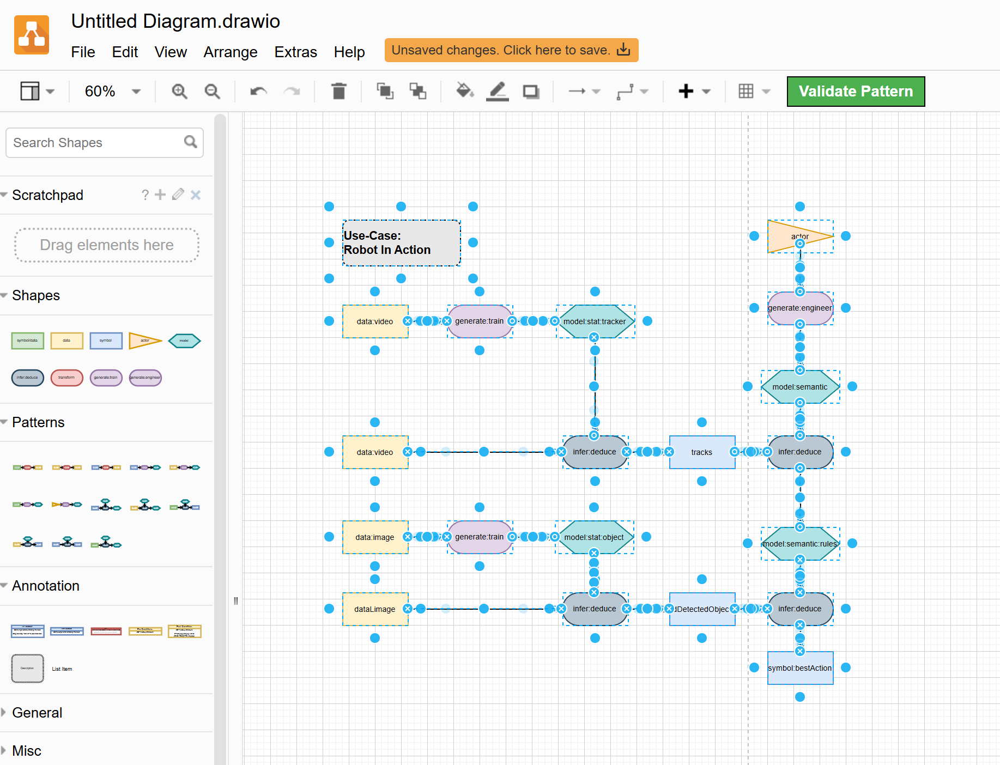
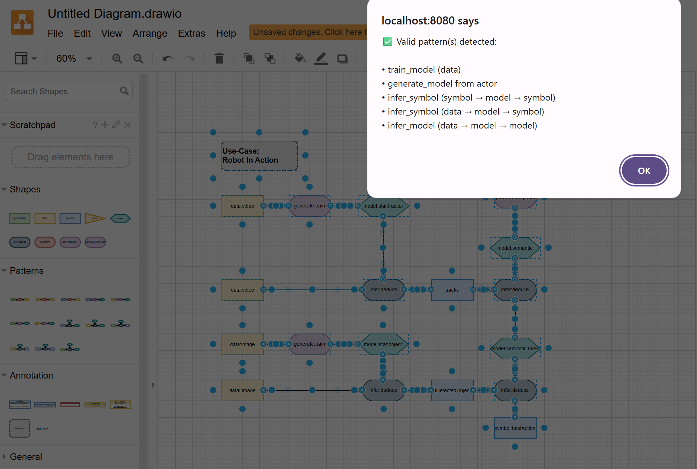

# 🧰 Tool4Boxology

[](https://creativecommons.org/licenses/by/4.0/)
[](https://opensource.org/licenses/MIT)
[](https://hub.docker.com/)  <!-- Update link -->
[]()
[]()
[]()


**Tool4Boxology** is a modular visual toolkit for designing and validating hybrid AI systems using the Boxology methodology. It provides a shared conceptual and visual language to describe systems that combine symbolic reasoning and machine learning.

This project is inspired by the work of **Frank van Harmelen** et al. in their paper:
> *"Modular Design Patterns for Hybrid Learning and Reasoning Systems: A Taxonomy, Patterns and Use Cases"* ([Web Semantics, 2023](https://doi.org/10.1016/j.websem.2023.100769))

---

## 🎯 Motivation

Hybrid AI systems lack a common language for design, validation, and communication. Tool4Boxology addresses this by:

- Providing a **visual grammar and formal syntax** for system components
- Enabling **modular, explainable design** with reusable patterns
- Offering real-time **validation tools** to reduce design errors early
- Enhancing documentation, automation, and traceability

---

## 🧩 Key Features

- ✅ Draw.io Plugin with validation logic
- 🧠 Formal grammar for elementary Boxology patterns
- 🧰 Custom vocabulary libraries
- 🖥️ GoJS-based interface for direct interaction
- 🐳 Dockerized setup for reproducible deployment

---

## 📦 Repository Structure

| Folder | Description |
|--------|-------------|
| `Boxology-Docker` | Docker container setup based on `fjudith/drawio`, including preloaded plugins and custom libraries. |
| `Boxology-interface` | Custom visual interface for Boxology models using GoJS. |
| `Boxology-plugin` | Draw.io plugin and vocabulary library for manual integration. |
| `ElementaryPattern` | Elementary patterns written in DOT language for modular visualization. |
| `Report` | Development report tracing project progress from scratch to implementation. |

---

## 🚀 Quick Start

### 1. Use the Plugin
- Open Draw.io (web or desktop)
- Import the plugin from the `Boxology-plugin` folder
- Load the vocabulary `.drawio` file to access custom shapes

### 2. Run with Docker
```bash
git clone https://github.com/SDM-TIB/Tool4Boxology.git
cd Tool4Boxology/Boxology-Docker
docker-compose up
```
Access Draw.io at `http://localhost:8080` with Boxology support.

### 3. Use the Interface
Open the GoJS-based visual editor from the `Boxology-interface` folder. Instructions are included in its README.

---

## 📘 Example

> _A sample hybrid AI pipeline using Boxology grammar._
> This diagram is a use case from Boxology paper (Robot in Action).




> ✅ Check for validation!





---

## 🔮 Future Work

- RDF export for integration into knowledge graphs
- SHACL-based validation for semantic consistency
- Enhanced support for reasoning templates and ontology-based rules

---

## 📄 Reference

- Harmelen, F. van, Liao, B., Ifrim, G., & Groth, P. (2023). Modular Design Patterns for Hybrid Learning and Reasoning Systems. *Journal of Web Semantics*, 79, 100769. [DOI](https://doi.org/10.1016/j.websem.2023.100769)
- Keet, C. M., & Rodríguez-Muro, M. (2023). Combining Machine Learning and Semantic Web: A Systematic Mapping Study. *ACM Computing Surveys*, 55(7), Article 140.

---

## 👤 Author & Contact

📧 Mahsa Forghani Tehrani  
🎓 Master Student, Leibniz University Hannover  
📮 mahsa.forghani.tehrani@stud.uni-hannover.de

---

## 📜 License

- 🧠 **Code** is licensed under the [MIT License](LICENSE).
- 📄 **Documentation, diagrams, and examples** are licensed under the [Creative Commons Attribution 4.0 International License](LICENSE-CC-BY-4.0).

[](https://creativecommons.org/licenses/by/4.0/)


---

## 🤝 Contributing

Pull requests and feedback are welcome! Please open issues for bugs, ideas, or questions.

