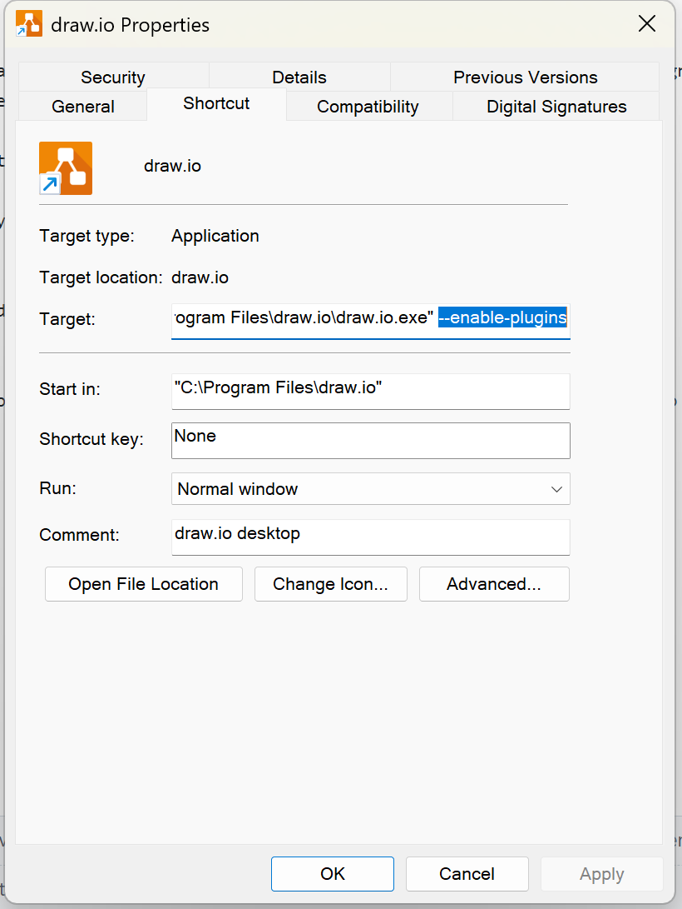

# Tool4Boxology
Your playground can be https://magjac.com/graphviz-visual-editor/
You also can use inserting shaped manually in this editor.
In this documentation, I tried to impelement shapes based on modular design pattern (Boxology).
You can use shapes impelementation code in file "Vocabulary", and each elementary pattern is created sepratedly.

Since each shapes has unique identification, we have to consider unique name for them, otherwise they integrate. For example, we have two Symbol in a system, so we should define Symbol1 and Symbol2. If we just define symbol, it consider same symbol in whole system design.

Use "rankdir" help use to keep the pattern organized

DOT language is case-sensetive (e.g: symbol ≠ Symbol)

##To Keep Improvement
Implement id for each attributes in order to use in Javascript in a SVG file in future.

**#How to use plugin?**

Now it only works on Drawio desktop. To upload external plugin in Drawio desktop, you should got to Draw.io app file > Properties > target field , Add: "--enable-plugins" 

Then, open Drawio app and follow this: Extras > Plugins > add ? select file: Boxology.js 

You can download Boxology.js [here](https://github.com/SDM-TIB/Tool4Boxology/blob/main/Boxology.js).
After restart the app, you can see component in left menue. If we use invalid connection, it will show us errors.

